# 舵机调试软件使用

[TOC]

## 概要

讲解了串口舵机调试软件的布局以及串口舵机主要功能的详细操作步骤。

## 软件下载

在FashionStar的官网，可以下载UART总线舵机的调试软件。

[FashionStar 舵机配套软件下载地址](https://fashionrobo.com/zh-hans/download/servo-software/)

软件包是一个`rar`后缀的压缩包，直接解压就可以，无需安装。

## 视频教程

[UART舵机功能演示(结合上位机)](http://v.qq.com/x/page/h3045ght3nx.html)

## 运行软件

软件安装完成后，进入到串口舵机调试软件的文件路径，点击`Develop.exe` 运行上位机软件。

## 上位机软件功能布局

## 物理接线

1. 首先将串口舵机插入到转接板上。
2. 接通外接电源，外接电压范围6.8v-7.4V。
3. USB线与电脑相连接。

**注意事项**

1. 转接板上的舵机接口任选一个。

2. 初次使用时，一次只插单个舵机，串口舵机的默认ID都是`0x00`，依次分配舵机ID。

   一般按照习惯，最下面的舵机ID设置为`0x00`，从下到上依次递增。

   舵机ID分配完成之后，再将舵机串联在一起。

3. 尽量不要带电拔插串口舵机。

## 串口连接

如果串口舵机转接板的串口号没有显示在串口列表，点击左上角的**刷新**`Refresh`  按钮。

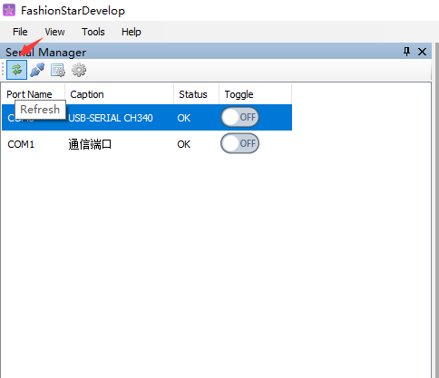

因为串口转接板使用的是`CH340`，列表的第一个`COM8` 就是转接板的设备号。 

按照下图所示创建串口连接。

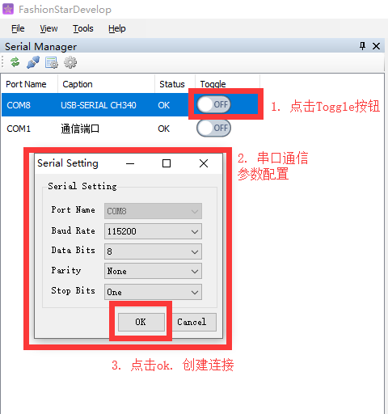

关于串口通信的详细参数见[串口通信配置](#串口通信配置), [<参数>波特率选项](#<参数>波特率选项)

**故障排查**

1. 未识别到串口舵机转接板

   * 可能是因为当前的操作系统并没有安装CH340的驱动

     [CH340驱动下载地址](http://www.wch.cn/download/CH341SER_EXE.html)

     [检查CH340驱动是否安装成功](https://jingyan.baidu.com/article/00a07f3872a90982d028dcb9.html)

   * usb端口松动，请尝试更换USB口/USB线。 

## 舵机扫描

设定舵机的波特率，并进行舵机扫描。

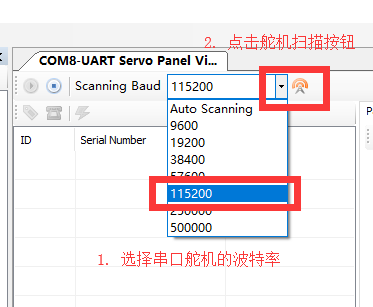

更新舵机列表

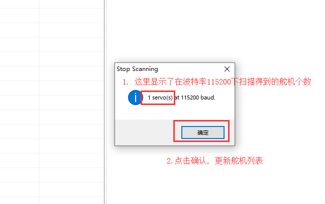

舵机列表各字段的含义

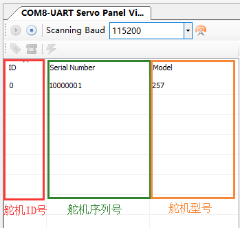

* 舵机ID号，是用户可以设定的舵机编号
* 舵机序列号，是舵机的唯一标识符，可以理解为舵机的身份证，由舵机厂家出厂时设置，不可修改
* 舵机型号，是当前舵机的型号名称，同样也属于只读字段

**故障排查**

1. 上位机卡死

   可能是由于当前的串口舵机总线上连接了多个ID号相同的舵机。

   初次使用的时候，一次只插单个舵机，串口舵机的默认ID都是`0x00`，依次分配舵机ID之后再将舵机串联在一起。

2. 获取不到舵机ID

   请检查舵机外接电源是否接上，电压是否满足条件（6.8-7.4v）。

   如果是使用的航模电池，请检查电池是否过放。

## 修改舵机ID

在舵机列表中选中要修改ID的舵机。

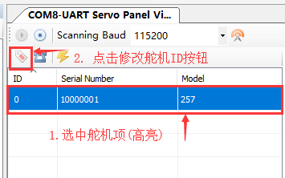

修改舵机ID

注意：不要直接在输入框中输入舵机ID，而是直接点击向上/向下箭头。

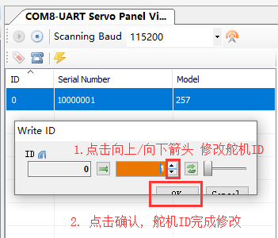

点击更新之后，舵机列表会自动刷新。

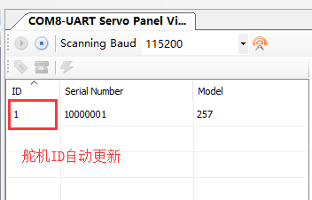

## 舵机控制模式选择

选中舵机，然后点击舵机控制模式测试按钮。

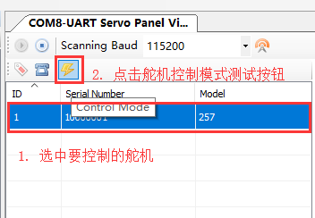

在上位机的操作界面上，一次只能控制单个舵机。

这里说舵机控制模式不是很准确，更详细的来说是选中此舵机，添加到舵机控制面板上，可以对舵机做如下操作

* `Parameters` 舵机用户自定义参数设置
* `Angle Mode` 舵机角度模式测试
* `Wheel Mode` 舵机轮式模式测试
* `Damping Mode` 舵机阻尼模式测试

## 修改用户自定义参数

选中`Parameters` 这个子窗口，你可以通过下拉框或者滑动条的方式修改舵机的用户自定义参数。

左侧是舵机原来的参数，右测是修改之后的参数。参数修改之后，绿色会变成橙色。

修改完成之后, 需要点击**写入参数**按钮。

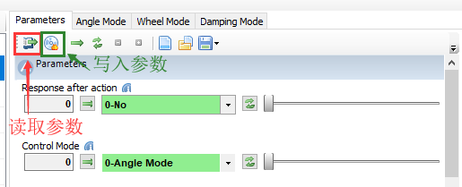

**注意事项**

1. 在进行阅读舵机参数列表时，不要滚动鼠标的滑动条，容易误触修改舵机参数

   (当然, 如果你不保存舵机参数就没事)。

## 舵机角度控制模式

舵机角度控制

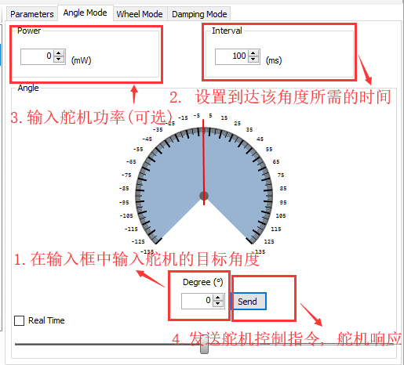

开启舵机实时控制模式

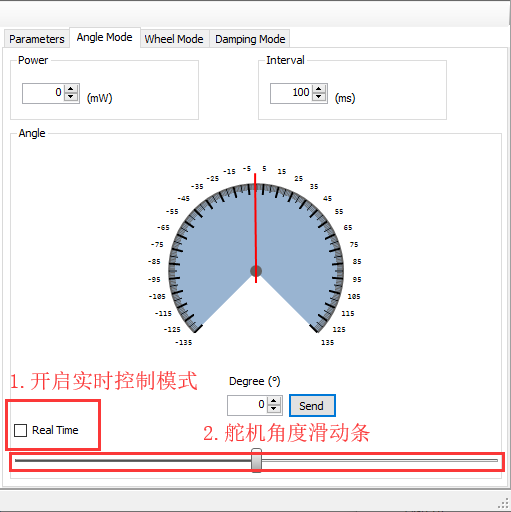

字段详细含义，请参考[<指令>设置舵机角度](#指令>设置舵机角度)。

**注意事项**

1. 舵机角度在上位机的输入框里的数值单位是°，实际在发送的时候，发送的数据单位是0.1°。

2. 注意设定的舵机角度不要超出范围，默认舵机的角度范围是$[-135°, 135°]$ 。

   也可以设置舵机的角度范围，详情参见[舵机用户自定义参数列表](#舵机用户自定义参数列表)里面的舵机角度上限和舵机角度下限。

3. 在设置舵机角度时也要考虑到机械结构的角度限制（例如机械臂等）。

4. 若无特殊要求，请设置`power=0`。

## 轮子模式控制

轮子模式有四种控制方式

1. 舵机停止
2. 舵机一直旋转
3. 定圈（旋转特定的圈数）
4. 定时（旋转特定的时间）

详情见[<指令>轮式模式控制](#<指令>轮式模式控制)

点击`Send` 舵机开始旋转。

## 阻尼模式

阻尼模式多用于机械臂示教。

在`Power` 填写舵机保持功率。可以修改参数为`500`，在旋转舵机时可以感受到阻力增大。

详情见[<指令> 阻尼模式控制](#<指令> 阻尼模式控制)

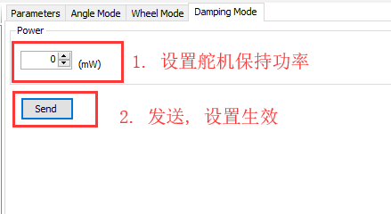

