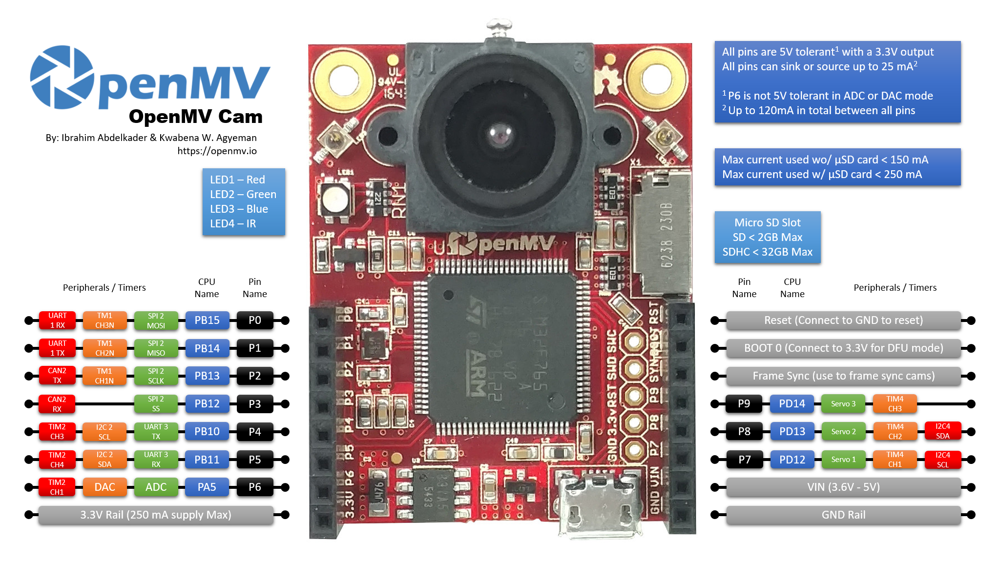
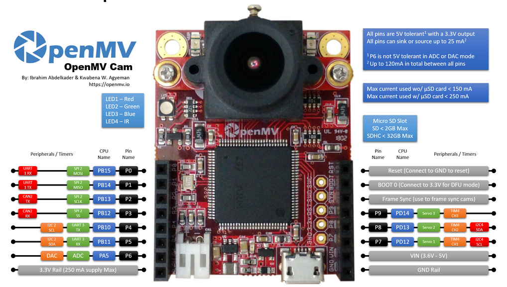

# 接线说明

[toc]

## 概要

课程提供的案例，接线图以及硬件资源配置都是保持一致的，因此把所有的接线部分的描述放在这一篇文章里。

*注：不需要把所有的线同时接好，根据运行的例程的需要，有选择的进行接线。*

## 固件下载

### STM32与STLinkV2的接线

通过STLinkV2给STM32下载固件。

*STM32与STLinkV2的接线图*

| STM32       | STLinkV2 |
| ----------- | -------- |
| SWIO / IO   | SWDIO    |
| SWCLK / CLK | SWCLK    |
| GND         | GND      |
| 3V3         | 3.3v     |

## 串口UART

### 串口资源

STM32F103一共有三个串口资源，分别为UART1、UART2、UART3。在舵机云台主题课程（STM32版）里，约定三个串口的用途分别为如下所示：

* `UART1` 接串口舵机转接板，控制串口舵机
* `UART2` 接USB转TTL模块，用于日志输出
* `UART3` 接OpenMV，用于接收图像处理得到的信息

### STM32与串口舵机的接线

串口1和串口舵机转接板的TTL接口相连，用于控制串口舵机。

*STM32与串口舵机转接板接线图*

| STM32F103 GPIO    | 串口舵机转接板 |
| ----------------- | -------------- |
| PA_9   (UART1 Tx) | Rx             |
| PA_10 (UART1 Rx)  | Tx             |
| 5v                | 5v             |
| GND               | GND            |

### STM32与USB转TTL模块

STM32的串口2与USB转TTL模块模块相连，给PC发送日志信息。

*STM32与USB转TTL接线图*

| STM32F103 GPIO  | USB转TTL模块 |
| --------------- | ------------ |
| PA_2 (UART2 Tx) | Rx           |
| PA_3 (UART2 Rx) | Tx           |
| GND             | GND          |

USB转TTL模块的USB口与电脑的USB口相连。

### STM32与OpenMV的接线

STM32的串口3接OpenMV，用于接收来自图像处理得到的信息。

[OpenMV 管脚布局-高清大图](http://docs.openmv.io/_images/pinout1.png)

#### OpenMV3

| STM32F103        | OpenMV3             |
| ---------------- | ------------------- |
| PB_11 (UART3 Rx) | P4 (PB10, UART3 Tx) |
| PB_10 (UART3 Tx) | P5 (PB11, UART3 Rx) |
| GND              | GND                 |
| 5V               | VIN                 |

> 注意: STM32F103的5V不能接到OpenMV的3.3v上，会烧坏OpenMV。

#### OpenMV4

OpenMV3与OpenMV4的布局相同，UART3对应的管脚以及位置都是兼容的。

| STM32F103        | OpenMV3             |
| ---------------- | ------------------- |
| PB_11 (UART3 Rx) | P4 (PB10, UART3 Tx) |
| PB_10 (UART3 Tx) | P5 (PB11, UART3 Rx) |
| GND              | GND                 |
| 5V               | VIN                 |

> 注意：STM32F103的5V注意不能接到OpenMV的3.3v上，会烧坏OpenMV。

## 其他传感器

### STM32与按键模块的接线

部分使用案例涉及到按键模块按键交互，需要用到四个按键分别调节偏航角与俯仰角的增加和减少。

为了接线方便，这里使用的是四位独立按键模块，你也可以使用四个按键模块，或者在面包板上搭建电路。

| STM32F103 | 按键模块 | 备注              |
| --------- | -------- | ----------------- |
| PB_4      | KEY1     | 偏航角增加 + 按键 |
| PB_5      | KEY2     | 偏航角减少 - 按键 |
| PB_6      | KEY3     | 俯仰角增加 + 按键 |
| PB_7      | KEY4     | 俯仰角减少 - 按键 |
| 5V        | VCC      |                   |
| GND       | GND      |                   |

###　激光模块

激光打点实验需要用到激光笔。

测试用到的激光笔的功率是5mW，波长为650nm，IO口可以直接驱动。最简单的方法是正极接STM32的5v，负极接GND。