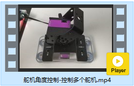
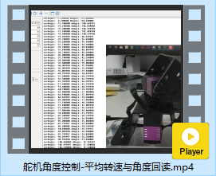

# 舵机角度控制


[toc]

## API使用说明

### 舵机角度控制

**函数原型**

```c
FSUS_STATUS FSUS_SetServoAngle(Usart_DataTypeDef *usart, uint8_t servo_id, float angle, uint16_t interval, uint16_t power, uint8_t wait);
```

* `usart` 舵机控制对应的串口数据对象`Usart_DataTypeDef`
* `servo_id` 舵机的ID
* `angle`  舵机的目标角度，取值范围$[-135.0, 135.0]$，精度精确到$0.1°$
* `interval` 舵机角度的旋转周期，单位ms
* `power`  舵机执行功率 mV 默认为0
* `wait`  设置舵机角度的时候，是否为阻塞式 
  * `0`：不阻塞
  * `1`：等待舵机旋转到特定的位置

**使用示例**

```c
//// 舵机控制相关的参数
// 舵机的ID号
uint8_t servoId = 0;  
// 舵机的目标角度
// 舵机角度在-135度到135度之间, 精确到小数点后一位
float angle = 0; 
// 时间间隔ms  
// 可以尝试修改设置更小的时间间隔，例如500ms
uint16_t interval = 2000; 
// 舵机执行功率 mV 默认为0	
uint16_t power = 0;
// 设置舵机角度的时候, 是否为阻塞式 
// 0:不等待 1:等待舵机旋转到特定的位置; 
uint8_t wait = 1; 

FSUS_SetServoAngle(servoUsart, servoId, angle, interval, power, wait);
```

### 舵机角度控制(指定周期)

**函数原型**

```c
/* 设置舵机的角度(指定周期) */
FSUS_STATUS FSUS_SetServoAngleByInterval(Usart_DataTypeDef *usart, uint8_t servo_id, \
				float angle, uint16_t interval, uint16_t t_acc, \
				uint16_t t_dec, uint16_t  power, uint8_t wait);
```


* `usart` 舵机控制对应的串口数据对象`Usart_DataTypeDef`
* `servo_id` 舵机的ID
* `angle`  舵机的目标角度，取值范围$[-135.0, 135.0]$，精度精确到$0.1°$
* `interval` 舵机角度的旋转周期，单位ms
* `t_acc` 加速时间, 单位ms
* `t_dec`减速时间,单位ms
* `power`  舵机执行功率 mV 默认为0
* `wait`  设置舵机角度的时候，是否为阻塞式 
  * `0`：不阻塞
  * `1`：等待舵机旋转到特定的位置


### 舵机角度控制(指定转速)

**函数原型**

```c
/* 设置舵机的角度(指定转速) */
FSUS_STATUS FSUS_SetServoAngleByVelocity(Usart_DataTypeDef *usart, uint8_t servo_id, \
				float angle, float velocity, uint16_t t_acc, \
				uint16_t t_dec, uint16_t  power, uint8_t wait);
```

* `usart` 舵机控制对应的串口数据对象`Usart_DataTypeDef`
* `servo_id` 舵机的ID
* `angle`  舵机的目标角度，取值范围$[-135.0, 135.0]$，精度精确到$0.1°$
* `velocity` 舵机目标转速，单位°/s
* `t_acc` 加速时间, 单位ms
* `t_dec`减速时间,单位ms
* `power`  舵机执行功率 mV 默认为0
* `wait`  设置舵机角度的时候，是否为阻塞式 
  * `0`：不阻塞
  * `1`：等待舵机旋转到特定的位置


### 舵机角度查询

**函数原型**

```c
// 查询单个舵机的角度信息 angle 单位度
FSUS_STATUS FSUS_QueryServoAngle(Usart_DataTypeDef *usart, uint8_t servo_id, float *angle);
```

* `usart` 舵机控制对应的串口数据对象`Usart_DataTypeDef`
* `servo_id` 舵机的ID
* `angle`舵机当前的角度，取值范围$[-135.0, 135.0]$，精度精确到$0.1°$


**使用示例**

```c
uint8_t servoId = 0;   	// 舵机的ID号
float curAngle = 0;		// 舵机当前所在的角度
FSUS_QueryServoAngle(servoUsart, servoId, &curAngle); // 读取一下舵机的角度
```


### 舵机角度控制(多圈模式)

**函数原型**

```c
/* 设置舵机的角度(多圈模式) */
FSUS_STATUS FSUS_SetServoAngleMTurn(Usart_DataTypeDef *usart, uint8_t servo_id, float angle, \
			uint32_t interval, uint16_t power, uint8_t wait);
```

* `usart` 舵机控制对应的串口数据对象`Usart_DataTypeDef`
* `servo_id` 舵机的ID
* `angle`  舵机的目标角度，取值范围$[-135.0, 135.0]$，精度精确到$0.1°$
* `interval` 舵机角度的旋转周期，单位ms
* `power`  舵机执行功率 mV 默认为0
* `wait`  设置舵机角度的时候，是否为阻塞式 
  * `0`：不阻塞
  * `1`：等待舵机旋转到特定的位置


### 舵机角度控制(多圈模式+指定周期)

**函数原型**

```c
/* 设置舵机的角度(多圈模式, 指定周期) */
FSUS_STATUS FSUS_SetServoAngleMTurnByInterval(Usart_DataTypeDef *usart, uint8_t servo_id, float angle, \
			uint32_t interval,  uint16_t t_acc,  uint16_t t_dec, uint16_t power, uint8_t wait);
```

* `usart` 舵机控制对应的串口数据对象`Usart_DataTypeDef`
* `servo_id` 舵机的ID
* `angle`  舵机的目标角度，取值范围$[-135.0, 135.0]$，精度精确到$0.1°$
* `interval` 舵机角度的旋转周期，单位ms
* `t_acc` 加速时间, 单位ms
* `t_dec`减速时间,单位ms
* `power`  舵机执行功率 mV 默认为0
* `wait`  设置舵机角度的时候，是否为阻塞式 
  * `0`：不阻塞
  * `1`：等待舵机旋转到特定的位置


### 舵机角度控制(多圈模式+指定转速)

**函数原型**

```c
/* 设置舵机的角度(多圈模式, 指定转速) */
FSUS_STATUS FSUS_SetServoAngleMTurnByVelocity(Usart_DataTypeDef *usart, uint8_t servo_id, float angle, \
			float velocity, uint16_t t_acc,  uint16_t t_dec, uint16_t power, uint8_t wait);
```

* `usart` 舵机控制对应的串口数据对象`Usart_DataTypeDef`
* `servo_id` 舵机的ID
* `angle`  舵机的目标角度，取值范围$[-135.0, 135.0]$，精度精确到$0.1°$
* `velocity` 舵机目标转速，单位°/s
* `t_acc` 加速时间, 单位ms
* `t_dec`减速时间,单位ms
* `power`  舵机执行功率 mV 默认为0
* `wait`  设置舵机角度的时候，是否为阻塞式 
  * `0`：不阻塞
  * `1`：等待舵机旋转到特定的位置


### 舵机角度查询(多圈模式)

**函数原型**

```c
/* 查询舵机的角度(多圈模式) */
FSUS_STATUS FSUS_QueryServoAngleMTurn(Usart_DataTypeDef *usart, uint8_t servo_id, float *angle);
```


* `usart` 舵机控制对应的串口数据对象`Usart_DataTypeDef`
* `servo_id` 舵机的ID
* `angle`舵机当前的角度，精度精确到$0.1°$


## 控制单个舵机

### 功能简介

测试控制舵机的角度, 演示了三种控制舵机角度的API

1. 角度控制控制
2. 角度控制模式+指定时间
3. 角度控制模式+指定目标转速

### 源代码

```c
/********************************************************
 * 测试控制舵机的角度, 让舵机在两个角度之间做周期性旋转
 ********************************************************/
#include "stm32f10x.h"
#include "usart.h"
#include "sys_tick.h"
#include "fashion_star_uart_servo.h"

// 使用串口1作为舵机控制的端口
// <接线说明>
// STM32F103 PA9(Tx) 	<----> 串口舵机转接板 Rx
// STM32F103 PA10(Rx) <----> 串口舵机转接板 Tx
// STM32F103 GND 		<----> 串口舵机转接板 GND
// STM32F103 V5 		<----> 串口舵机转接板 5V
// <注意事项>
// 使用前确保已设置usart.h里面的USART1_ENABLE为1
// 设置完成之后, 将下行取消注释
Usart_DataTypeDef* servo_usart = &usart1; 

// 使用串口2作为舵机控制的端口
// <接线说明>
// STM32F103 PA2(Tx) 	<----> 串口舵机转接板 Rx
// STM32F103 PA3(Rx) 	<----> 串口舵机转接板 Tx
// STM32F103 GND 	 	<----> 串口舵机转接板 GND
// STM32F103 V5	 	<----> 串口舵机转接板 5V
// <注意事项>
// 使用前确保已设置usart.h里面的USART2_ENABLE为1
// 设置完成之后, 将下行取消注释
Usart_DataTypeDef* logging_usart = &usart2;

// 重定向c库函数printf到串口，重定向后可使用printf函数
int fputc(int ch, FILE *f)
{
	while((logging_usart->pUSARTx->SR&0X40)==0){}
	/* 发送一个字节数据到串口 */
	USART_SendData(logging_usart->pUSARTx, (uint8_t) ch);
	/* 等待发送完毕 */
	// while (USART_GetFlagStatus(USART1, USART_FLAG_TC) != SET);		
	return (ch);
}


//// 舵机控制相关的参数
// 舵机的ID号
uint8_t servo_id = 0;  
// 舵机的目标角度
// 舵机角度在-135度到135度之间, 精确到小数点后一位
float angle = 0; 
// 时间间隔ms  
// 可以尝试修改设置更小的时间间隔，例如500ms
uint16_t interval;
// 目标转速
float velocity;
// 加速时间
uint16_t t_acc;
// 减速时间
uint16_t t_dec;
// 舵机执行功率 mV 默认为0	
uint16_t power = 0;
// 设置舵机角度的时候, 是否为阻塞式 
// 0:不等待 1:等待舵机旋转到特定的位置; 
uint8_t wait = 1; 
// 读取的角度
float angle_read;

int main (void)
{
	// 嘀嗒定时器初始化
	SysTick_Init();
	// 串口初始化
	Usart_Init();
	
	while (1){
		printf("GOTO: 135.0f\r\n");
		// 控制舵机角度
		angle = 135.0;
		interval = 2000;
		FSUS_SetServoAngle(servo_usart, servo_id, angle, interval, power, wait);
		FSUS_QueryServoAngle(servo_usart, servo_id, &angle_read);
		printf("Cur Angle: %.1f\r\n", angle_read);
		
		// 等待2s
		SysTick_DelayMs(2000);
		
		// 控制舵机角度 + 指定时间
		printf("GOTO+Interval: 0.0f\r\n");
		angle = 0.0f;
		interval = 1000;
		t_acc = 100;
		t_dec = 150;
		FSUS_SetServoAngleByInterval(servo_usart, servo_id, angle, interval, t_acc, t_dec, power, wait);
		FSUS_QueryServoAngle(servo_usart, servo_id, &angle_read);
		printf("Cur Angle: %.1f\r\n", angle_read);
		
		// 等待2s
		SysTick_DelayMs(2000);
		
		// 控制舵机角度 + 指定转速
		printf("GOTO+Velocity: -135.0f\r\n");
		angle = -135.0f;
		velocity = 200.0f;
		t_acc = 100;
		t_dec = 150;
		FSUS_SetServoAngleByVelocity(servo_usart, servo_id, angle, velocity, t_acc, t_dec, power, wait);
		FSUS_QueryServoAngle(servo_usart, servo_id, &angle_read);
		printf("Cur Angle: %.1f\r\n", angle_read);
  }
}

```


### 输出日志

```
GOTO: 135.0f
Cur Angle: 134.7
GOTO+Interval: 0.0f
Cur Angle: 0.3
GOTO+Velocity: -135.0f
Cur Angle: -134.6
```


## 控制多个舵机

### 功能简介

演示如何同时控制多几个舵机。


### 效果视频

效果视频路径:`效果视频/舵机角度控制-控制多个舵机.mp4`




### 源代码

```c
#include "stm32f10x.h"
#include "usart.h"
#include "sys_tick.h"
#include "fashion_star_uart_servo.h"

// 使用串口1作为舵机控制的端口
// <接线说明>
// STM32F103 PA9(Tx) 	<----> 串口舵机转接板 Rx
// STM32F103 PA10(Rx) <----> 串口舵机转接板 Tx
// STM32F103 GND 		<----> 串口舵机转接板 GND
// STM32F103 V5 		<----> 串口舵机转接板 5V
// <注意事项>
// 使用前确保已设置usart.h里面的USART1_ENABLE为1
// 设置完成之后, 将下行取消注释
Usart_DataTypeDef* servoUsart = &usart1; 

//// 舵机控制相关的参数
// 时间间隔ms  
// 可以尝试修改设置更小的时间间隔，例如500ms
uint16_t interval = 2000; 
// 舵机执行功率 mV 默认为0	
uint16_t power = 0;
// 设置舵机角度的时候, 是否为阻塞式 
// 0:不等待 1:等待舵机旋转到特定的位置; 
uint8_t wait = 0; 

int main (void)
{
	// 嘀嗒定时器初始化
	SysTick_Init();
	// 串口初始化
	Usart_Init();
	
	while (1)
    {	
		// 控制舵机云台角度
		FSUS_SetServoAngle(servoUsart, 0, 135.0, interval, power, wait);
		FSUS_SetServoAngle(servoUsart, 1, 45.0, interval, power, wait);
		// 等待动作完成
		SysTick_DelayMs(interval);
		
		// 等待2s
		SysTick_DelayMs(2000);
		
		// 控制舵机旋转到另外一个角度
		FSUS_SetServoAngle(servoUsart, 0, -135.0, interval, power, wait);
		FSUS_SetServoAngle(servoUsart, 1, -45.0, interval, power, wait);
		// 等待动作完成
		SysTick_DelayMs(interval);
		
		// 等待2s
		SysTick_DelayMs(2000);
    }
}
```


## 平均转速与角度回读 

### 功能简介

控制舵机角度-平均转速与角度回读
 1. 查询当前角度，根据平均转速和目标角度估计执行周期。

 2. 通过周期性查询舵机角度，判断舵机是否到达目标角度。

 3. 测试舵机的死区(Dead Block)/稳态误差。

    

### 效果视频

效果视频路径:`效果视频/舵机角度控制-平均转速与角度回读.mp4`




### 源代码

```c
#include "stm32f10x.h"
#include "usart.h"
#include "sys_tick.h"
#include "fashion_star_uart_servo.h"

// 使用串口1作为舵机控制的端口
// <接线说明>
// STM32F103 PA9(Tx) 	<----> 串口舵机转接板 Rx
// STM32F103 PA10(Rx) 	<----> 串口舵机转接板 Tx
// STM32F103 GND 		<----> 串口舵机转接板 GND
// STM32F103 V5 		<----> 串口舵机转接板 5V
// <注意事项>
// 使用前确保已设置usart.h里面的USART1_ENABLE为1
// 设置完成之后, 将下行取消注释
Usart_DataTypeDef* servoUsart = &usart1; 

// 使用串口2作为日志输出的端口
// <接线说明>
// STM32F103 PA2(Tx) <----> USB转TTL Rx
// STM32F103 PA3(Rx) <----> USB转TTL Tx
// STM32F103 GND 	 <----> USB转TTL GND
// STM32F103 V5 	 <----> USB转TTL 5V (可选)
// <注意事项>
// 使用前确保已设置usart.h里面的USART2_ENABLE为1
Usart_DataTypeDef* loggingUsart = &usart2;

// 重定向c库函数printf到串口，重定向后可使用printf函数
int fputc(int ch, FILE *f)
{
	while((loggingUsart->pUSARTx->SR&0X40)==0){}
	/* 发送一个字节数据到串口 */
	USART_SendData(loggingUsart->pUSARTx, (uint8_t) ch);
	/* 等待发送完毕 */
	// while (USART_GetFlagStatus(USART1, USART_FLAG_TC) != SET);		
	return (ch);
}

// 舵机控制相关的参数
uint8_t servoId = 0; 	// 舵机的ID
float curAngle = 0;		// 舵机当前所在的角度
float nextAngle = 0; 	// 舵机的目标角度
uint16_t speed = 200; 	// 舵机的转速 单位 °/s
uint16_t interval = 0; 	// 舵机旋转的周期
uint16_t power = 0; 	// 舵机执行功率 mV 默认为0	W
uint8_t wait = 0;  		// 0:不等待 1:等待舵机旋转到特定的位置;
// 舵机角度死区, 如果舵机当前角度跟
// 目标角度相差小于死区则代表舵机到达目标角度, 舵机不再旋转
// <注意事项>
// 		死区跟舵机的型号有关系, 取决于舵机固件的设置, 不同型号的舵机会有差别
float servoDeadBlock = 1.0; 

// 查询舵机的角度
uint16_t calcIntervalMs(uint8_t servoId, float nextAngle, float speed){
	// 读取一下舵机的角度
	FSUS_QueryServoAngle(servoUsart, servoId, &curAngle);
	// 计算角度误差
	float dAngle =  (nextAngle > curAngle) ? (nextAngle - curAngle) : (curAngle - nextAngle);
	// 计算所需的时间
	return (uint16_t)((dAngle / speed) * 1000.0);
}

// 等待舵机进入空闲状态IDLE, 即舵机到达目标角度
void waitUntilServoIDLE(uint8_t servoId, float nextAngle){
	
	while(1){
		// 读取一下舵机的角度
		FSUS_QueryServoAngle(servoUsart, servoId, &curAngle);
		
		// 判断舵机是否达到目标角度
		float dAngle =  (nextAngle > curAngle) ? (nextAngle - curAngle) : (curAngle - nextAngle);
		
		// 打印一下当前的舵机角度
		printf("curAngle: %f dAngle: %f\r\n", curAngle, dAngle);
		
		// 判断是否小于死区
		if (dAngle <= servoDeadBlock){
			break;
		}
		// 等待一小段时间
		SysTick_DelayMs(5);
	}
}


int main (void)
{
	// 嘀嗒定时器初始化
	SysTick_Init();
	// 串口初始化
	Usart_Init();
	
	while (1)
    {	
		// 设置舵机的目标角度
		nextAngle = 120.0;
		// 根据转速还有角度误差计算周期
		interval = calcIntervalMs(servoId, nextAngle, speed);
		printf("Set Servo %f-> %f", curAngle, nextAngle);
		// 控制舵机角度
		FSUS_SetServoAngle(servoUsart, servoId, nextAngle, interval, power, wait);
		// SysTick_DelayMs(interval);
		SysTick_DelayMs(5);
		waitUntilServoIDLE(servoId, nextAngle);
		
		// 等待1s 看舵机死区范围
		SysTick_DelayMs(1000);
		// 读取一下舵机的角度
		FSUS_QueryServoAngle(servoUsart, servoId, &curAngle);
		printf("Final Angle: %f", curAngle);
		SysTick_DelayMs(1000);
		
		// 设置舵机的目标角度
		nextAngle = -120;
		// 根据转速还有角度误差计算周期
		interval = calcIntervalMs(servoId, nextAngle, speed);
		// 控制舵机角度
		FSUS_SetServoAngle(servoUsart, servoId, nextAngle, interval, power, wait);
		// 需要延时一会儿，确保舵机接收并开始执行舵机控制指令
		// 如果马上发送舵机角度查询信息,新发送的这条指令可能会覆盖舵机角度控制信息
		SysTick_DelayMs(5);
		waitUntilServoIDLE(servoId, nextAngle);
		
		// 等待1s 看舵机死区范围
		SysTick_DelayMs(1000);
		// 读取一下舵机的角度
		FSUS_QueryServoAngle(servoUsart, servoId, &curAngle);
		printf("Final Angle: %f", curAngle);
		SysTick_DelayMs(1000);
    }
}
```


## 多圈控制模式

### 功能简介

舵机还有多圈位置控制模式，角度控制范围为$[-368640.0°, 368640.0°]$

历程演示了多种多圈控制模式：

1. 多圈角度控制控制
2. 多圈角度控制模式+指定时间
3. 多圈角度控制模式+指定目标转速


### 源代码


```c
/********************************************************
 * 舵机多圈控制模式演示
 ********************************************************/
#include "stm32f10x.h"
#include "usart.h"
#include "sys_tick.h"
#include "fashion_star_uart_servo.h"

// 使用串口1作为舵机控制的端口
// <接线说明>
// STM32F103 PA9(Tx) 	<----> 串口舵机转接板 Rx
// STM32F103 PA10(Rx) <----> 串口舵机转接板 Tx
// STM32F103 GND 		<----> 串口舵机转接板 GND
// STM32F103 V5 		<----> 串口舵机转接板 5V
// <注意事项>
// 使用前确保已设置usart.h里面的USART1_ENABLE为1
// 设置完成之后, 将下行取消注释
Usart_DataTypeDef* servo_usart = &usart1; 

// 使用串口2作为舵机控制的端口
// <接线说明>
// STM32F103 PA2(Tx) 	<----> 串口舵机转接板 Rx
// STM32F103 PA3(Rx) 	<----> 串口舵机转接板 Tx
// STM32F103 GND 	 	<----> 串口舵机转接板 GND
// STM32F103 V5	 	<----> 串口舵机转接板 5V
// <注意事项>
// 使用前确保已设置usart.h里面的USART2_ENABLE为1
// 设置完成之后, 将下行取消注释
Usart_DataTypeDef* loggingUsart = &usart2;

// 重定向c库函数printf到串口，重定向后可使用printf函数
int fputc(int ch, FILE *f)
{
	while((loggingUsart->pUSARTx->SR&0X40)==0){}
	/* 发送一个字节数据到串口 */
	USART_SendData(loggingUsart->pUSARTx, (uint8_t) ch);
	/* 等待发送完毕 */
	// while (USART_GetFlagStatus(USART1, USART_FLAG_TC) != SET);		
	return (ch);
}


// 使用串口3作为舵机控制的端口
// <接线说明>
// STM32F103 PB10(Tx) <----> 串口舵机转接板 Rx
// STM32F103 PB11(Rx) <----> 串口舵机转接板 Tx
// STM32F103 GND 		<----> 串口舵机转接板 GND
// STM32F103 V5 		<----> 串口舵机转接板 5V
// <注意事项>
// 使用前确保已设置usart.h里面的USART1_ENABLE为1
// 设置完成之后, 将下行取消注释
// Usart_DataTypeDef* servo_usart = &usart3; 

//// 舵机控制相关的参数
// 舵机的ID号
uint8_t servo_id = 0;  
// 舵机的目标角度
// 舵机角度在-135度到135度之间, 精确到小数点后一位
float angle; 
uint32_t interval; 	// 时间间隔ms  
float velocity; 		// 电机转速, 单位dps,°/s
// 舵机执行功率 mV 默认为0	
uint16_t power = 0;
// 设置舵机角度的时候, 是否为阻塞式 
// 0:不等待 1:等待舵机旋转到特定的位置; 
uint8_t wait = 1; 
// 加速时间(单位ms)
uint16_t t_acc;
// 减速时间
uint16_t t_dec;

// 读取的角度
float angle_read;
int main (void)
{
	// 嘀嗒定时器初始化
	SysTick_Init();
	// 串口初始化
	Usart_Init();
	
	while (1){	
		printf("MTurn GOTO: 720.0f\r\n");
		// 控制舵机角度(多圈)
		angle = 720.0f;
		interval = 2000;
		FSUS_SetServoAngleMTurn(servo_usart, servo_id, angle, interval, power, wait);
		FSUS_QueryServoAngleMTurn(servo_usart, servo_id, &angle_read);
		printf("Cur Angle: %.1f\r\n", angle_read);
		
		// 等待2s
		SysTick_DelayMs(2000);
		
		// 控制舵机旋转到另外一个角度(多圈)
		printf("MTurn GOTO: 0.0f\r\n");
		angle = 0.0;
		FSUS_SetServoAngleMTurn(servo_usart, servo_id, angle, interval, power, wait);
		FSUS_QueryServoAngleMTurn(servo_usart, servo_id, &angle_read);
		printf("Cur Angle: %.1f\r\n", angle_read);
		
		// 等待2s
		SysTick_DelayMs(2000);
		
		
		// 控制舵机角度(多圈+指定周期)
		printf("MTurn+Interval GOTO: -180.0f\r\n");
		angle = 180.0f;	
		interval = 1000;
		t_acc = 100;
		t_dec = 200;
		FSUS_SetServoAngleMTurnByInterval(servo_usart, servo_id, angle, interval, t_acc, t_dec, power, wait);
		FSUS_QueryServoAngleMTurn(servo_usart, servo_id, &angle_read);
		printf("Cur Angle: %.1f\r\n", angle_read);
		
		// 等待2s
		SysTick_DelayMs(2000);
		
		// 控制舵机角度(多圈+指定转速)
		printf("MTurn+Velocity GOTO: -180.0f\r\n");
		angle = -180.0f;
		velocity = 100.0f;
		t_acc = 100;
		t_dec = 200;
		FSUS_SetServoAngleMTurnByVelocity(servo_usart, servo_id, angle, velocity, t_acc, t_dec, power, wait);
		FSUS_QueryServoAngleMTurn(servo_usart, servo_id, &angle_read);
		printf("Cur Angle: %.1f\r\n", angle_read);
		
		// 等待2s
		SysTick_DelayMs(2000);
		
  }
}

```


### 日志

输出日志: 

```
MTurn GOTO: 720.0f
Cur Angle: 719.7
MTurn GOTO: 0.0f
Cur Angle: 0.4
MTurn+Interval GOTO: -180.0f
Cur Angle: 179.7
MTurn+Velocity GOTO: -180.0f
Cur Angle: -179.5
MTurn GOTO: 720.0f
Cur Angle: 719.5
MTurn GOTO: 0.0f
Cur Angle: 0.4
MTurn+Interval GOTO: -180.0f
Cur Angle: 179.7
MTurn+Velocity GOTO: -180.0f
Cur Angle: -179.5
```


